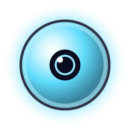
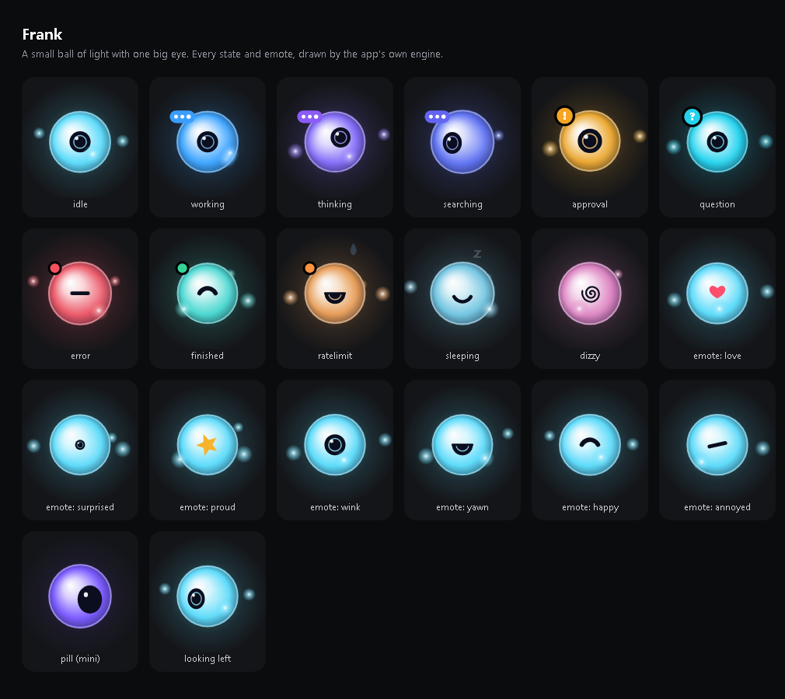

<div align="center">



# Frank

**Маленький шарик света в верхней части экрана, который работает с Claude Code и разговаривает с тобой.**

[English](README.md) · [Türkçe](README.tr.md) · **Русский**

</div>



## Что умеет Frank

- **Следит за сессиями Claude Code в реальном времени**: показывает, что каждая из них читает, редактирует и запускает, во всех твоих окнах.
- **Даёт подтверждать действия прямо сверху экрана**: когда Claude Code просит разрешения, Frank показывает **Разрешить / Запретить**. Возвращаться в терминал не нужно.
- **Общается с Claude** через твою собственную подписку Claude, **без API-ключа**.
- **Разговаривает с тобой**: скажи **«Frank»**, и он слушает, отвечает вслух и продолжает слушать. Чтобы перебить его, снова скажи его имя.
- **Говорит на твоём языке**: понимает русский, турецкий и английский и отвечает на том языке, на котором ты спросил. Интерфейс тоже на всех трёх языках.
- **Знает твои проекты**: спроси *«как дела у проекта сайта?»*, и он прочитает папку проекта и расскажет. Он только смотрит файлы и ничего в них не меняет.
- **Передаёт указания**: скажи *«Frank, скажи проекту сайта увеличить заголовок»*, и он отправит указание сессии Claude Code, которая работает в этом проекте.
- **Смотрит вместо тебя**: вставь скриншот (**Win + Shift + S**, затем **Ctrl + V**) или перетащи на него файл и задай вопрос.

## Сколько это стоит

Frank бесплатный и с открытым исходным кодом (лицензия MIT). Он использует:

- **Твой вход в Claude Code** (Claude Pro или Max) для чата. Ответы расходуют лимиты твоего плана. API-ключа нет, и дополнительных списаний тоже нет, пока в настройках аккаунта Claude выключен *extra usage*.
- **Бесплатные голосовые инструменты с открытым кодом, которые работают на твоём компьютере**: whisper.cpp превращает речь в текст, Piper превращает текст в речь. Звук никогда не покидает твой ПК.

## Требования

- Windows 10 или 11, 64-бит
- [Claude Code](https://claude.com/claude-code), в который выполнен вход с твоим аккаунтом Claude: выполни `npm install -g @anthropic-ai/claude-code`, затем один раз запусти `claude`, чтобы войти.
- Необязательно: видеокарта NVIDIA делает распознавание речи быстрее и точнее.
- Только если собираешь Frank сам (всё бесплатно): [Rust](https://rustup.rs), [Node.js 20+](https://nodejs.org) и [Visual Studio Build Tools](https://visualstudio.microsoft.com/visual-cpp-build-tools/) с компонентом **Desktop development with C++**

## Установка

### Скачать (проще всего)

1. **Скачай [Frank-Windows-setup.exe](../../releases/latest/download/Frank-Windows-setup.exe)** со страницы [последнего выпуска](../../releases/latest).
2. **Запусти его.** Он устанавливается только для твоего пользователя, права администратора не нужны. Windows может предупредить, что у установщика нет цифровой подписи: выбери *Подробнее → Выполнить в любом случае*.
3. **В конце установки согласись скачать голосовые инструменты.** Они скачиваются в отдельном окне в папку `%LOCALAPPDATA%\Frank\voice`: около 1,5 ГБ с видеокартой NVIDIA, около 0,7 ГБ без неё. Каждый файл привязан к конкретному выпуску и перед использованием проверяется по SHA-256.
4. **Запусти Frank** из меню «Пуск». Он появится вверху по центру экрана.

Чтобы убедиться, что скачанный файл настоящий, выполни в PowerShell `Get-FileHash Frank-Windows-setup.exe` и сравни результат с SHA-256 на странице выпуска.

### Собрать самому

1. **Получи код:** склонируй репозиторий через `git clone` (или скачай ZIP) и открой PowerShell в его папке.
2. **Собери:**
   ```powershell
   npm install
   npm run sounds
   npm run icons
   $env:CARGO_PROFILE_RELEASE_LTO = "thin"
   $env:CARGO_PROFILE_RELEASE_CODEGEN_UNITS = "16"
   npm run pack
   ```
   Установщик появится в папке `release\`. Две строки `CARGO_…` не дают сборке исчерпать память на компьютерах с 16-24 ГБ ОЗУ. Первая сборка занимает несколько минут.
3. **Установи:** запусти `release\Frank-Windows-setup.exe` и продолжай с шага 3 раздела *Скачать* выше.

## Первые шаги

1. **Подключи Claude Code:**
   - Нажми правой кнопкой на значок Frank в области уведомлений → **Настройки…** → **Claude Code** → **Установить хуки…**
   - Ты увидишь, что именно изменится в настройках Claude Code. Перед записью создаётся резервная копия с датой.
   - Затем открой новую сессию Claude Code.
2. **Голос без рук:** Настройки → **Общие** → включи **Кодовое слово**. Само слово тоже можно поменять.
3. **Язык:** Настройки → **Общие** → **Язык**. «Автоматически» использует язык Windows.

## Как пользоваться

| Что ты делаешь | Что делает Frank |
|---|---|
| Подводишь мышь к верху экрана по центру | Выглядывает |
| Нажимаешь на него | Открывается «остров» |
| Говоришь **«Frank»** (кодовое слово включено) | Открывается и слушает |
| Говоришь просьбу на одном дыхании: **«Frank, …»** | Сразу выполняет |
| Говоришь **«Frank»**, пока он говорит | Замолкает и слушает |
| Нажимаешь на микрофон в чате | Начинается голосовой разговор без кодового слова |
| **Win + Shift + S**, затем **Ctrl + V** в чате | Прикрепляет скриншот |
| Перетаскиваешь файл на «остров» | Проглатывает файл и отвечает на вопросы о нём |
| Claude Code просит разрешения | Вверху экрана появляется **Разрешить / Запретить** |

Голосовой разговор сам заканчивается примерно после 15 секунд тишины.

## Конфиденциальность

- Никакой телеметрии и никакого собственного аккаунта.
- Речь распознаётся и озвучивается **на твоём компьютере**. В Claude уходит только текст запроса, через твой собственный Claude Code.
- Frank читает папки проектов только когда ты о них спрашиваешь и никогда не может изменить их сам. Указания для проекта выполняет твоя собственная сессия Claude Code в этом проекте, со своими настройками разрешений.
- Ключи необязательных интеграций хранятся в диспетчере учётных данных Windows и никогда не записываются на диск.

## Решение проблем

- **Windows предупреждает об установщике:** у него нет цифровой подписи (подпись стоит денег каждый год). Если ты его скачал, сначала проверь SHA-256, затем выбери *Подробнее → Выполнить в любом случае*.
- **Сборка останавливается с ошибкой «out of memory»:** используй две строки `CARGO_…` из шага сборки.
- **Frank тебя не слышит:** в параметрах Windows (Конфиденциальность и защита → Микрофон) должно быть включено *Разрешить классическим приложениям доступ к микрофону*.
- **Ошибка «Для голосового чата не хватает: … (в %LOCALAPPDATA%\Frank\voice)»:** запусти установщик Frank ещё раз и согласись скачать голосовые инструменты. Прерванная загрузка продолжится с того же места.
- **Frank говорит, что не может связаться с проектом:** сначала открой Claude Code в папке этого проекта. После этого он сможет передавать ему указания.

## Благодарности и лицензия

Frank распространяется с открытым кодом по [лицензии MIT](LICENSE). Его код вырос из проекта [Coucou](https://github.com/Louis-CFM/coucou) Луи Райе (Louis Raillé, MIT). Персонаж, значок и звуки Frank созданы специально для него и нарисованы и синтезированы кодом. Frank — независимый проект, он не связан с автором Coucou и не одобрен им. Сторонние компоненты и их лицензии перечислены в [THIRD-PARTY-NOTICES.md](THIRD-PARTY-NOTICES.md).
